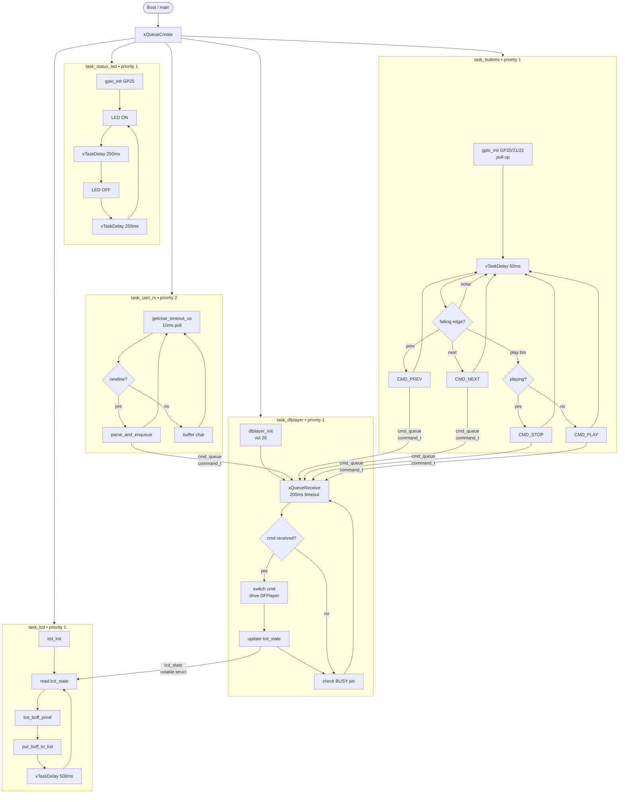

# MP3 Control Project

ระบบควบคุม DFPlayer Mini ผ่าน Serial command บน Raspberry Pi Pico 2 (RP2350) + FreeRTOS  
แสดงสถานะผ่าน LCD 16x2 I2C และ LED blink

---

## Hardware

| อุปกรณ์ | รายละเอียด |
|---------|------------|
| MCU | Raspberry Pi Pico 2 (RP2350) |
| MP3 Module | DFPlayer Mini |
| Display | LCD 16x2 I2C (PCF8574, address 0x27) |
| Interface | USB CDC (Serial Monitor) รับคำสั่งจาก PC |

### Wiring

```
Pico 2                          DFPlayer Mini
 GP0  (TX)  ─────────────────→  RX
 GP1  (RX)  ←─────────────────  TX
 GP15 (IN)  ←─────────────────  BUSY  (LOW = playing, HIGH = idle)
 GND        ─────────────────── GND
 3.3V/5V    ─────────────────── VCC
                                 SPK+ → ลำโพง
                                 SPK- → ลำโพง

Pico 2                          LCD 16x2 I2C
 GP2  (SDA) ─────────────────→  SDA
 GP3  (SCL) ─────────────────→  SCL
 GND        ─────────────────── GND
 3.3V/5V    ─────────────────── VCC

Pico 2                          Buttons (active LOW)
 GP20 (IN)  ────── BTN ── GND   Prev track
 GP21 (IN)  ────── BTN ── GND   Next track
 GP22 (IN)  ────── BTN ── GND   Toggle Play/Stop
```

---

## Features

- รับคำสั่ง text ผ่าน USB Serial — ควบคุมได้จาก PC
- ปุ่มกดจริง GP20/GP21/GP22 — prev / next / toggle play/stop
- ควบคุม play / stop / next / prev / volume / repeat
- แสดงสถานะ track และ volume บน LCD 16x2 แบบ real-time
- BUSY pin monitor — แจ้งทาง Serial เมื่อเริ่มเล่นและจบ
- Status LED blink GP25 บอกว่าบอร์ดยังทำงานอยู่
- Repeat mode filter — ไม่ spam Serial ระหว่าง loop

---

## Serial Commands

พิมพ์คำสั่งแล้วกด Enter ผ่าน Serial Monitor (baud ใดก็ได้, USB CDC)

| คำสั่ง | ผลลัพธ์ |
|--------|---------|
| `play <n>` | เล่น track ที่ n (1–99) |
| `stop` | หยุดเล่น |
| `next` | track ถัดไป |
| `prev` | track ก่อนหน้า |
| `vol <n>` | ตั้ง volume (0–30) |
| `repeat all` | วนเล่นทุก track |
| `repeat one` | วนเล่น track ปัจจุบัน |
| `repeat off` | ปิด repeat |

ตัวอย่าง:
```
> play 1
OK: playing track 1
INFO: playing
INFO: track finished
> vol 20
OK: volume set to 20
> repeat all
OK: repeat all
> stop
OK: stopped
> play 99
ERR: track out of range (usage: play <1-99>)
> xyz
ERR: unknown command
```

---

## LCD Display

```
┌────────────────┐
│ Track: 1       │
│ Vol:20 Playing │
└────────────────┘
```

อัปเดตทุก 500ms แสดง track ปัจจุบัน, volume, และสถานะ Playing/Stopped

---

## FreeRTOS Task Structure



| Task | Priority | Stack | หน้าที่ |
|------|----------|-------|---------|
| `task_uart_rx` | 2 | 512 words | รับ command จาก USB, parse, ส่ง Queue |
| `task_dfplayer` | 1 | 512 words | ขับ DFPlayer, monitor BUSY pin, อัปเดต lcd_state |
| `task_lcd` | 1 | 512 words | อ่าน lcd_state แล้วแสดงบน LCD ทุก 500ms |
| `task_status_led` | 1 | 256 words | blink LED GP25 ทุก 250ms |
| `task_buttons` | 1 | 256 words | poll GP20/21/22 ทุก 50ms, debounce, ส่ง Queue |

---

## โครงสร้างไฟล์

```
MP3 Control Project/
├── inc/
│   ├── FreeRTOSConfig.h     # ตั้งค่า FreeRTOS kernel
│   ├── dfplayer.h           # DFPlayer Mini API
│   └── i2c_lcd.h            # LCD 16x2 I2C API
├── lib/
│   └── FreeRTOS-Kernel/     # FreeRTOS submodule
├── src/
│   ├── main.c               # Tasks, Queue, command parser, lcd_state
│   ├── dfplayer.c           # UART0 driver สำหรับ DFPlayer Mini
│   └── i2c_lcd.c            # I2C driver สำหรับ LCD 16x2 (PCF8574)
├── CMakeLists.txt
└── pico_sdk_import.cmake
```

---

## Build

**ต้องการ:** Pico SDK 2.2.0, ARM GCC 15.2, CMake, Ninja

```powershell
$cmake   = "C:\Users\<user>\.pico-sdk\cmake\v3.31.5\bin\cmake.exe"
$ninja   = "C:\Users\<user>\.pico-sdk\ninja\v1.12.1\ninja.exe"
$sdk     = "C:\Users\<user>\.pico-sdk\sdk\2.2.0"
$project = "<path>\MP3 Control Project"

& $cmake -S "$project" -B "$project\build" `
  -DPICO_SDK_PATH="$sdk" -DPICO_BOARD=pico2 `
  -DCMAKE_BUILD_TYPE=Release `
  -DCMAKE_MAKE_PROGRAM="$ninja" -G Ninja

& $ninja -C "$project\build"
```

ไฟล์ `.uf2` จะอยู่ที่ `build/MP3_Control_Project.uf2` — กด BOOTSEL แล้วลาก drop ลงบอร์ดได้เลย

---

## Branches

| Branch | คำอธิบาย |
|--------|----------|
| `main` | พัฒนาหลัก |
| `feature/dfplayer-uart-control-demo` | Demo DFPlayer Mini + LCD |
| `Blink_Test` | LED blink ทดสอบบอร์ด |
