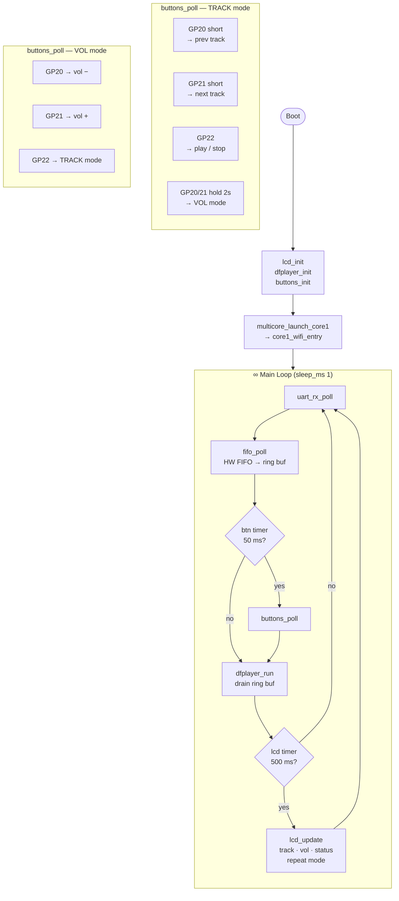
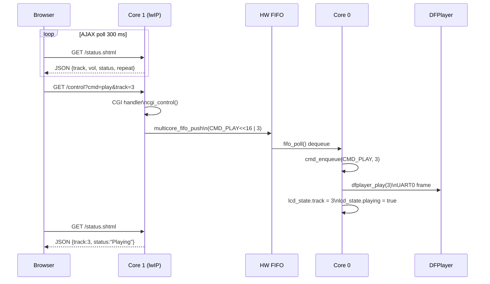

# MP3 Control Project

ระบบควบคุม DFPlayer Mini บน **Raspberry Pi Pico 2W (RP2350)**
สถาปัตยกรรม **bare-metal dual-core** — ไม่ใช้ RTOS

- **Core 0** — main loop: LCD, ปุ่ม, DFPlayer, UART
- **Core 1** — CYW43 WiFi poll + lwIP HTTP server
- **Web UI** real-time AJAX ควบคุมได้จากมือถือ / PC

---

## System Architecture

```mermaid
flowchart TB
    BR(["Browser / AJAX 300ms"])

    subgraph C1["Core 1 - CYW43 poll loop"]
        HTTPD["lwIP httpd / CGI / SSI"]
    end

    FIFO["HW FIFO 8 entries"]

    subgraph C0["Core 0 - bare-metal loop"]
        CMDQ["ring buffer command_t x8"]
        DRV["dfplayer_run / lcd_update"]
        STATE[("lcd_state volatile")]
    end

    DFP(["DFPlayer Mini - UART0 GP0/GP1"])
    LCD(["LCD 16x2 - I2C1 GP2/GP3"])
    BTNS(["Buttons GP20/21/22"])
    SER(["USB Serial CDC"])

    BR    -->|request|     HTTPD
    HTTPD -->|response|    BR
    HTTPD -->|CGI cmd|     FIFO
    HTTPD -.->|SSI read|   STATE
    FIFO  -->|fifo_poll|   CMDQ
    BTNS  -->              CMDQ
    SER   -->              CMDQ
    CMDQ  -->              DRV
    DRV   -->              STATE
    DRV   -->|UART|        DFP
    DRV   -->|I2C|         LCD
```

---

## Core 0 — Main Loop



---

## Web Request Flow



---

## Hardware

### Wiring

```
Pico 2W                         DFPlayer Mini
 GP0  (UART0 TX) ─────────────→  RX
 GP1  (UART0 RX) ←─────────────  TX
 GP15 (IN)       ←─────────────  BUSY  (LOW=playing)
 GND             ────────────── GND
 VSYS            ────────────── VCC (5V)
                                  SPK+ → ลำโพง
                                  SPK- → ลำโพง

Pico 2W                         LCD 16×2 I2C (PCF8574 @ 0x27)
 GP2  (I2C1 SDA) ─────────────→  SDA
 GP3  (I2C1 SCL) ─────────────→  SCL
 GND             ────────────── GND
 3.3V            ────────────── VCC

Pico 2W                         Buttons (active LOW, internal pull-up)
 GP20 (IN) ── BTN ── GND        Prev / Vol−
 GP21 (IN) ── BTN ── GND        Next / Vol+
 GP22 (IN) ── BTN ── GND        Play/Stop · Exit Vol mode
```

### Pin Summary

| Pin | ทิศทาง | อุปกรณ์ |
|-----|--------|---------|
| GP0 | OUT | DFPlayer RX (UART0 TX) |
| GP1 | IN  | DFPlayer TX (UART0 RX) |
| GP2 | I/O | LCD SDA (I2C1) |
| GP3 | I/O | LCD SCL (I2C1) |
| GP15 | IN | DFPlayer BUSY |
| GP20 | IN | BTN Prev / Vol− |
| GP21 | IN | BTN Next / Vol+ |
| GP22 | IN | BTN Play/Stop |
| LED | OUT | CYW43 LED (blink = WiFi alive) |

---

## Features

- **Web UI** — dark-theme responsive, AJAX real-time 300ms, ใช้งานได้บนมือถือ
- **Play/Pause toggle** — ปุ่มเดียว, icon เปลี่ยนตาม state
- **Volume slider** — slide แล้วส่งอัตโนมัติ debounce 400ms
- **Repeat mode** — All / One / Off พร้อม highlight ปุ่ม active
- **LCD** — แสดง track, vol, status (Play/Paus/Stop), repeat mode
- **Buttons** — TRACK mode / VOL mode (hold 2s เข้า VOL mode)
- **Serial commands** — ควบคุมผ่าน USB CDC

---

## Serial Commands

| คำสั่ง | ผลลัพธ์ |
|--------|---------|
| `play <n>` | เล่น track n (1–99) |
| `stop` | หยุด |
| `pause` | พัก |
| `next` | track ถัดไป |
| `prev` | track ก่อนหน้า |
| `vol <n>` | ตั้ง volume (0–30) |
| `repeat all` | วนทุก track |
| `repeat one` | วน track ปัจจุบัน |
| `repeat off` | ปิด repeat |

---

## LCD Display

**Track mode**
```
┌────────────────┐
│ Track: 3       │
│ V:20 Play [ALL]│
└────────────────┘
```

**Vol mode** (hold GP20/21 ค้าง 2s)
```
┌────────────────┐
│ [ Vol Mode ]   │
│ < Vol: 20 >    │
└────────────────┘
```

**WiFi page** (สลับทุก 3s)
```
┌────────────────┐
│ WiFi: OK       │
│ 192.168.0.25   │
└────────────────┘
```

---

## โครงสร้างไฟล์

```
MP3 Control Project/
├── fs/
│   ├── index.shtml         # Web UI (dark theme, AJAX)
│   └── status.shtml        # JSON status endpoint (SSI)
├── inc/
│   ├── dfplayer.h          # DFPlayer Mini API
│   ├── fsdata_custom.c     # lwIP embedded filesystem (generated)
│   ├── i2c_lcd.h           # LCD 16×2 I2C API
│   ├── lwipopts.h          # lwIP config (NO_SYS=1 poll mode)
│   ├── main_shared.h       # shared types: command_t, lcd_state_t
│   └── web_server.h        # WiFi credentials + core1_wifi_entry()
├── src/
│   ├── main.c              # Core 0 bare-metal loop
│   ├── dfplayer.c          # UART0 driver
│   ├── i2c_lcd.c           # I2C LCD driver (PCF8574)
│   └── web_server.c        # Core 1: CYW43 + lwIP + CGI + SSI
├── lib/
│   └── FreeRTOS-Kernel/    # (ไม่ได้ใช้ใน branch นี้)
├── CMakeLists.txt
└── pico_sdk_import.cmake
```

---

## Build

**ต้องการ:** Pico SDK 2.2.0, ARM GCC 15.2, CMake, Ninja

```bash
cd build
cmake .. -G Ninja -DPICO_BOARD=pico2_w
ninja
```

ไฟล์ `build/MP3_Control_Project.uf2` — กด BOOTSEL แล้วลาก drop ลงบอร์ดได้เลย

> **WiFi credentials** อยู่ใน `inc/web_server.h` — เปลี่ยน `WIFI_SSID` และ `WIFI_PASS` ก่อน build

---

## Branches

| Branch | คำอธิบาย |
|--------|----------|
| `feature/lwip-web-control` | **branch นี้** — bare-metal multicore + Web UI |
| `feature/dfplayer-uart-control-demo` | Demo DFPlayer + LCD (FreeRTOS) |
| `lcd_i2c_exsample` | ตัวอย่าง LCD I2C (FreeRTOS) |
| `Blink_Test` | LED blink ทดสอบบอร์ด |
| `main` / `master` | พัฒนาหลัก |
